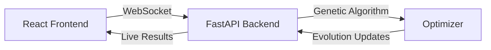

# TSP Solver: Genetic Algorithm Visualization

A real-time visualization platform for genetic algorithms solving the Traveling Salesman Problem (TSP). Watch evolution in action as the algorithm discovers increasingly efficient routes between cities.

## 🌟 Key Features

- **Real-time Evolution Visualization**: Watch the algorithm evolve solutions live through an interactive SVG visualization
- **Customizable Parameters**: Fine-tune population size, mutation rates, and crossover probabilities
- **Dynamic City Management**: Add, remove, and modify city locations on the fly
- **Performance Metrics**: Track best fitness, average fitness, and population diversity across generations
- **WebSocket Integration**: Live updates ensure smooth, real-time data flow between the optimization engine and UI

## Use it now
- https://geneticalgo.netlify.app/


## 🧬 How It Works

### The Genetic Algorithm

The application uses a genetic algorithm to solve the Traveling Salesman Problem through simulated evolution:

1. **Initialization**: 
   - Creates a random population of potential routes
   - Each "individual" represents a specific order of cities to visit

2. **Evolution Cycle**:
   ```
   Population → Selection → Crossover → Mutation → New Population
   ```
   - **Selection**: Chooses better-performing routes through tournament selection
   - **Crossover**: Combines successful routes to create new potential solutions
   - **Mutation**: Introduces random changes to maintain diversity

3. **Fitness Evaluation**:
   - Calculates total distance for each route
   - Shorter distances = better fitness
   - Tracks best solutions across generations

### Real-time Architecture



1. **Frontend (React + TypeScript)**
   - Manages optimization parameters through forms
   - Renders real-time visualizations using SVG
   - Plots performance metrics with Recharts

2. **Backend (FastAPI + Python)**
   - Handles WebSocket connections for live updates
   - Manages concurrent optimization tasks
   - Implements the genetic algorithm optimizer
   - Provides RESTful endpoints for task management

3. **Data Flow**
   - Frontend initiates optimization with parameters
   - Backend streams generation-by-generation updates
   - UI updates in real-time with new routes and metrics

## 🚀 Technical Stack

### Frontend
- React 18
- TypeScript
- Recharts for data visualization
- Tailwind CSS for styling
- WebSocket for real-time communication

### Backend
- FastAPI
- NumPy for genetic algorithm operations
- Asyncio for concurrent task handling

## 🤝 Contributing

1. **Clone and Install**
   ```bash
   git clone <repository-url>
   cd genetic-algorithm-system
   npm run install:all
   ```

2. **Start Development Server**
   ```bash
   npm run dev
   ```
   This launches both frontend and backend servers concurrently.

3. **Access the Application**
   - Frontend: http://localhost:3000
   - Backend: http://localhost:8000
     

### Submit a pull request

If you'd like to contribute, please fork the repository and open a pull request to the `main` branch.

## 🔧 Configuration

The genetic algorithm can be customized through several key parameters:

- `population_size`: Number of routes in each generation (10-1000)
- `mutation_rate`: Probability of random route modifications (0-100%)
- `crossover_rate`: Probability of combining routes (0-100%)
- `max_generations`: Maximum evolution cycles (1-1000)

## 💡 Learning Opportunities

This project demonstrates several modern web development concepts:

- Real-time data visualization
- WebSocket communication
- State management in React
- Genetic algorithms and optimization
- TypeScript type safety
- Modern UI component libraries
- Concurrent backend processing

## 🛠️ Future Enhancements

- [X] Hosting (this should be done very soon), so you can access the application without having to launch it locally
- [ ] Additional optimization problems (function optimization, knapsack problem)
- [ ] Performance improvements for larger city sets

## 🤝 Contact

If you are looking to hire, please feel free to reach out to me here or on [LinkedIn](https://www.linkedin.com/in/ezra-huffman/). (I don't want to put my contact info in a public repo)

## 📝 License

This project is licensed under the MIT License - see the [LICENSE](LICENSE) file for details.

---

Built with 💻 by Ezra Huffman for fun.
